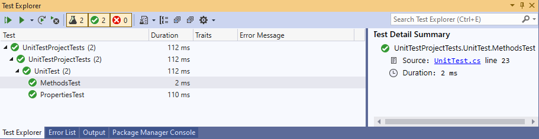

# csharp-unit-test
單元測試，使用xUnit Test、Moq。  

### 作法
使用Moq套件的Mock建立假的物件，並且設定函式、屬性、返回的值，再使用xUnit提供的驗證方法進行測試。

### 簡易範例

```csharp
/// <summary>
/// 方法單元測試
/// </summary>
[Fact]
public void MethodsTest()
{
    // 準備 Mock IFoo 介面
    var mock = new Mock<IFoo>();
    // 配置準備模擬的方法，當呼叫介面中的 DoSomething 方法，並傳遞引數 "bing" 的時候，返回 true
    mock.Setup(foo => foo.DoSomething("ping")).Returns(true);
    // 現在，你可以: 
    IFoo foo = mock.Object;
    // 檢查使用時返回值為True
    Assert.True(foo.DoSomething("ping"));
}

/// <summary>
/// 屬性單元測試
/// </summary>
[Fact]
public void PropertiesTest()
{
    // 準備 Mock IFoo 介面
    var mock = new Mock<IFoo>();
    // 開始 "tracking" 屬性的 sets/gets 
    mock.SetupProperty(f => f.Name);
    // 提供一個預設的值
    mock.SetupProperty(f => f.Name, "foo");
    // 現在，你可以: 
    IFoo foo = mock.Object;
    // 儲存的值 
    Assert.Equal("foo", foo.Name);
    // 重新設定一個值
    foo.Name = "bar";
    Assert.Equal("bar", foo.Name);
}
```
### 測試結果


### 參考資料
- https://github.com/Moq/moq4/wiki/Quickstart#verification
- https://xunit.net/  
